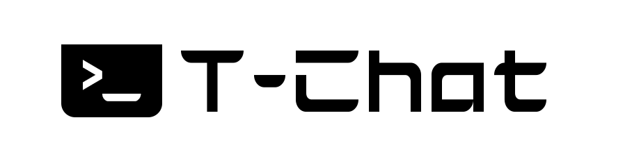

#  [](https://www.javascript.com/) [](https://www.javascript.com/) 
 
 


## About the project

The idea of the App is:

*"I aimed to learn how to develop a messaging app based on Wechat that uses interactive interfaces using only the terminal and command line."*

## Why?

To learn how to develop a messaging app and to study advanced concepts and practices on Javascript;

Send me an email: lucasomarandradeleal@gmail.com

Connect to my [Linkedin](https://linkedin.com/in/lucasomarandradeleal)

Feel free to use it as a study and make improvements.

***The project is opensource!!!***

## Installers

If you want to test the application, click the button below:

**Download installer:** Soon!

## Functionalities

- Chat with other people in a chat room, see who enters or leaves and also online users.
- All of this straight from your terminal!!!

## Getting Started

### Prerequisites

To run this project in the development mode, you'll need to have a basic environment to run a React-Native App.

Use [NodeJS](https://nodejs.org/pt-br/download/package-manager/#debian-and-ubuntu-based-linux-distributions-enterprise-linux-fedora-and-snap-packages) framework to manipulate the application.

### Installing

**Cloning the Repository**

```
$ git clone https://github.com/lucasoal/hacker-chat

$ cd hacker-chat
```

**Installing dependencies**

```
$ yarn
```

_or_

```
$ npm install
```

### Running

With all dependencies installed and the environment properly configured, you can now run the app:

In the *client*  directory run the command:

`npm start`


This will update your terminal showing the application running in real time.

***It's still not working!
Only layout implemented!***

## Built With

- [NodeJS](https://nodejs.org/en/) - Build using **JavaScript** and **NodeJS**
- [Blessed](https://www.npmjs.com/package/blessed) - Library for terminal interface API for **JS**.


## Support tools

- [Adobe Photoshop](https://www.adobe.com/br/products/photoshop.html?sdid=KQPOM&mv=search&ef_id=CjwKCAjw9MuCBhBUEiwAbDZ-7pp8x1aRZcX8yl7QTPdxKmjMIZex78_1SSUFBmDuDqXYv9DlU_qgWRoC6HMQAvD_BwE:G:s&s_kwcid=AL!3085!3!473120541801!e!!g!!photoshop!188192502!10077842982&gclid=CjwKCAjw9MuCBhBUEiwAbDZ-7pp8x1aRZcX8yl7QTPdxKmjMIZex78_1SSUFBmDuDqXYv9DlU_qgWRoC6HMQAvD_BwE) - Image manipulation
- [Stack Overflow](https://stackoverflow.com/) - Research and also bug fixing
- [Stack Edit](https://stackedit.io/) - README edition

## Contributing

If you have any question about the project...

Email-me: lucasomarandradeleal@gmail.com

Connect to my [Linkedin](https://linkedin.com/in/lucasomarandradeleal)

Thank you!
